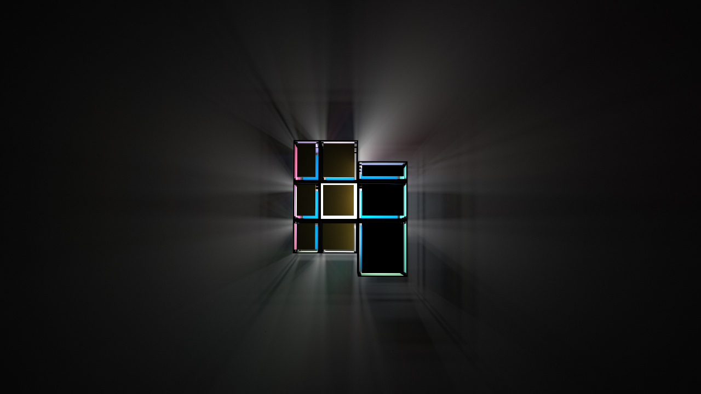

# Magic Cube

## 简介

66行代码实现 镜面+普通三阶魔方+镜面魔中魔（自己瞎取的名字），只需修改第65行输入的参数，就能实现对魔方的控制（如何打乱/体素颜色/体素类型），加上一些灯光的操作，再找到一个合适的截图角度，就能做出漂亮的图片了。可以调整的参数有很多，我只尝试了其中一小部分，还有无限的可能，等待大家去挖掘。(main.py/dark.py/shadow.py代码的差别只是用于控制灯光的两三行，所以就把他们都放到一个项目里了。)
第一个参数控制魔方类型（可以是1/2/3），第二三个参数分别是镜面和颜色如何打乱，输入英文字符是随机打乱，数字字符串是可控打乱（0-5分别对应与RLUDFB），第4-7个参数控制魔方的块，8-11控制边框线，最后一个控制色块外表面。

## 代码思路

## 结果展示

## main.py

demo_main_1:my_cube(3,'050322144255145','3141525', 0, 0.2,0.2,0.2, 0, 0,0,0, 1)

demo_main_2:my_cube(3,'050322144255145','3141525', 1, 0.2,0.2,0.2, 1, 0,0,0, 1)

demo_main_3:my_cube(2,'0000','001122334455', 0, 0.2,0.2,0.2, 1, 0.4,0.4,0.4, 0)

demo_main_4:my_cube(2,'0000','001122334455', 0, 0.2,0.2,0.2, 0, 0,0,0, 1)

demo_main_5:my_cube(2,'0000','001122334455', 1, 0.2,0.2,0.2, 1, 0,0,0, 1)

demo_main_6:my_cube(1,'020202','0000', 1, 1,0.75,0.79, 1, 0,0,0, 1)

demo_main_7:my_cube(3,'020202','001122334455', 1, 0.2,0.2,0.2, 1, 0,0,0, 1)

## dark.py
demo_dark_1:my_cube(3,'050322144255145','3141525', 0, 0.2,0.2,0.2, 1, 0.4,0.4,0.4, 0)

demo_dark_2:my_cube(3,'050322144255145','3141525', 0, 0.3,0.3,0.3, 0, 0,0,0, 1)

demo_dark_3:my_cube(3,'050322144255145','3141525', 1, 0.3,0.3,0.3, 1, 0,0,0, 1)

## shadow.py
demo_shadow_1:my_cube(2,'0000','001122334455', 0, 0.2,0.2,0.2, 0, 0,0,0, 1)

demo_shadow_2:my_cube(2,'0000','001122334455', 0, 0.2,0.2,0.2, 1, 0,0,0, 1)

demo_shadow_3:my_cube(3,'0000','001122334455', 0, 0.2,0.2,0.2, 0, 0,0,0, 1)

demo_shadow_4:my_cube(3,'0000','001122334455', 0, 0.2,0.2,0.2, 1, 0,0,0, 1)

demo_shadow_5:my_cube(3,'0','0000', 0, 0.2,0.2,0.2, 1, 0,0,0, 1)

